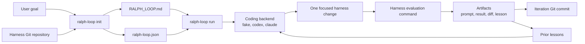

# Ralph Loop Optimizer


[This repo is an early open-source framework for iterative agentic optimization.]

Ralph Loop Optimizer is an all-purpose optimizer for programmable strategies,
architectures, policies, prompts, and workflows. It turns any local Git
repository with an evaluation command into an AI-driven improvement loop.

Use it for problems where progress can be measured but the next improvement is
hard to hand-design: ML model architecture self-improvement, financial strategy
development, quantum circuit optimization, agent policy tuning, benchmarked
solver refinement, prompt iteration, simulation-driven design, or any other
programmable system with repeatable feedback.

Give it a harness repository and an optimization goal. It prepares an operating
brief, asks a coding CLI to make one focused improvement, runs the harness
evaluation, records the result and lesson, commits the iteration, and repeats
until the configured iteration limit is reached.

For suitable harnesses, that means you can go AFK while the AI iteratively
self-improves your strategy, architecture, or workflow against the feedback loop
you defined.

## Architecture



## What It Optimizes

Ralph Loop Optimizer owns orchestration. Your harness owns the domain.

The optimizer handles:

- creating `RALPH_LOOP.md` and `ralph-loop.json`
- calling a coding backend such as Codex CLI or Claude Code
- running or recording evaluation
- saving prompts, outputs, diffs, results, and lessons
- committing completed iterations in the harness repository
- resuming recorded runs

The harness handles:

- the code, policy, model, prompt, strategy, or workflow being improved
- setup and dependency instructions
- scoring, tests, simulations, training, or benchmark logic
- the definition of success for the domain
- boundaries for what the AI may edit

The optimizer does not require a fixed metric schema. Evaluation output can be
plain logs, JSON, Markdown, CSV, test output, benchmark tables, generated files,
or any other text that is visible and useful for comparison.

## Requirements

- Python 3.11 or newer
- Git
- a local harness repository at its Git root
- optionally, Codex CLI or Claude Code for real AI-backed iterations

The package has no runtime Python dependencies. Development and tests use
`pytest`.

## Install

From this repository:

```bash
python -m pip install -e ".[dev]"
```

Check the CLI:

```bash
ralph-loop --help
ralph-loop backends
```

## Quick Start

The repository includes a deterministic toy benchmark that can be copied into a
separate harness repository. The example uses the `fake` backend, which exercises
the optimizer flow without calling an AI model or editing target files.

```bash
python -m pip install -e ".[dev]"

HARNESS_DIR="$(mktemp -d)/toy-benchmark-harness"
cp -R examples/toy-benchmark "$HARNESS_DIR"
cd "$HARNESS_DIR"

git init
git add .
git -c user.name="Ralph Loop Demo" \
  -c user.email="ralph-loop-demo@example.com" \
  commit -m "initial toy benchmark harness"

python evaluate.py
```

Initialize Ralph Loop Optimizer against the copied harness:

```bash
ralph-loop init \
  --harness "$HARNESS_DIR" \
  --goal "Improve the deterministic toy benchmark score." \
  --evaluation-command "python evaluate.py" \
  --backend fake
```

This creates:

```text
RALPH_LOOP.md
ralph-loop.json
```

Review those files, then commit them before starting the run:

```bash
git add RALPH_LOOP.md ralph-loop.json
git commit -m "prepare Ralph Loop run"
```

Run one configured optimization loop:

```bash
ralph-loop status --harness "$HARNESS_DIR"
ralph-loop run --config "$HARNESS_DIR/ralph-loop.json"
ralph-loop status --harness "$HARNESS_DIR"
```

The fake backend is useful for verifying artifact creation, evaluation capture,
lesson updates, and Git commits. To make actual AI edits, use `--backend codex`
or `--backend claude` after installing and configuring the corresponding CLI.

## Lifecycle

### 1. Initialize

```bash
ralph-loop init \
  --harness /path/to/harness \
  --goal "Describe what should improve." \
  --evaluation-command "python evaluate.py" \
  --backend fake
```

`init` writes a starter operating brief and config without starting
optimization. By default it also asks the selected backend to review the brief
inside the init boundary. That review may only leave `RALPH_LOOP.md` and
`ralph-loop.json` dirty.

Use `--skip-ai-review` when you only want the mechanical starter files:

```bash
ralph-loop init \
  --harness /path/to/harness \
  --goal "Describe what should improve." \
  --evaluation-command "python evaluate.py" \
  --backend fake \
  --skip-ai-review
```

Use `--overwrite` only when replacing existing starter files intentionally.

### 2. Review And Commit

Before running optimization, review:

- `RALPH_LOOP.md`: goal, relevant harness files, environment notes, edit scope,
  AI behavior requirements, and open questions
- `ralph-loop.json`: backend, max iterations, evaluation command, artifact
  directory, timeout, and resume behavior

The harness worktree must be clean before `run` or `resume`. Commit the reviewed
starter files in the harness repository.

### 3. Run

```bash
ralph-loop run --config /path/to/harness/ralph-loop.json
```

Each iteration:

1. loads the operating brief, prior lessons, latest evaluation, and worktree
   status
2. sends one implementation prompt to the configured backend
3. runs the configured evaluation command, or records manual evaluation mode
4. captures the implementation diff
5. writes iteration artifacts
6. sends a lesson-update prompt to the same backend
7. stages and commits the completed iteration in the harness repository

Backends are instructed not to commit. Ralph Loop Optimizer owns staging and the
final iteration commit.

### 4. Inspect Or Resume

Inspect a harness and its recorded runs:

```bash
ralph-loop status --harness /path/to/harness
ralph-loop status --harness /path/to/harness --run-id run-YYYYMMDDTHHMMSSffffffZ
```

Resume a recorded run:

```bash
ralph-loop resume \
  --harness /path/to/harness \
  --run-id run-YYYYMMDDTHHMMSSffffffZ
```

Resume validates the run artifacts, requires a clean worktree, restores `HEAD`
to the last completed iteration commit when needed, and continues from the next
safe iteration number.

## Configuration

`ralph-loop init` writes `ralph-loop.json` at the harness root.

Example:

```json
{
  "harness_path": "/absolute/path/to/harness",
  "goal": "Improve the deterministic toy benchmark score.",
  "backend": "fake",
  "max_iterations": 1,
  "evaluation_command": "python evaluate.py",
  "run_artifact_dir": "ralph_loop_runs",
  "command_timeout_seconds": null,
  "resume_behavior": "refuse_dirty"
}
```

Fields:

- `harness_path`: absolute path to the harness Git repository root
- `goal`: optimization objective passed into iteration prompts
- `backend`: `fake`, `codex`, or `claude`
- `max_iterations`: maximum iterations for `run` or `resume`
- `evaluation_command`: shell command run from the harness root after each
  implementation attempt; omit for manual evaluation mode
- `run_artifact_dir`: relative directory for run history
- `command_timeout_seconds`: optional timeout for backend and evaluation
  commands
- `resume_behavior`: current resume policy setting

Use the same command wrapper you would use manually in the harness, such as
`uv run`, `poetry run`, `.venv/bin/python`, or `conda run -n <env>`.

Keep domain-specific settings inside the harness unless the optimizer needs
them for orchestration.

## Generated Artifacts

Run artifacts are written inside the harness repository:

```text
RALPH_LOOP.md
ralph-loop.json
ralph_loop_runs/
  <run_id>/
    config.json
    iterations/
      001/
        prompt.md
        lesson_prompt.md
        result.md
        lesson.md
        diff.patch
```

Artifact roles:

- `RALPH_LOOP.md`: human-readable operating brief for the run
- `ralph-loop.json`: starter config used by `run`
- `prompt.md`: implementation prompt sent to the backend
- `lesson_prompt.md`: post-evaluation lesson-update prompt
- `result.md`: normalized iteration summary with captured evaluation output
- `lesson.md`: compact lesson for later iterations
- `diff.patch`: captured implementation diff

Each completed iteration is committed in the harness repository with its
artifacts.

## Backends

List installed backend names accepted by the package:

```bash
ralph-loop backends
```

Current backends:

- `fake`: deterministic test backend; does not call an AI model
- `codex`: runs Codex CLI with `codex exec`
- `claude`: runs Claude Code with `claude --print`

The real backend adapters pass prompts through stdin, stream progress during
interactive CLI runs, and capture stdout, stderr, exit code, and elapsed time.

## Example Harnesses

Example folders are templates. Copy an example into its own Git repository
before using it as a harness.

- `examples/toy-benchmark/`: dependency-free deterministic benchmark. The
  editable target is `strategy.py`; `evaluate.py` owns scoring.
- `examples/cifar10-cnn/`: PyTorch and torchvision CIFAR-10 harness. Editable
  targets are `model.py` and `train_config.py`; `evaluate.py` owns data loading,
  training, and scoring. This example downloads CIFAR-10 into `data/`.
- `examples/us-stock-strategy/`: yfinance-based US stock trading harness.
  Editable target is `strategy.py`; `evaluate.py` owns Yahoo Finance data
  caching, next-open trade execution, portfolio accounting, buy-and-hold
  comparison, and financial metrics.

## Development

Run the test suite:

```bash
python -m pytest
```

Run only real CLI availability checks:

```bash
python -m pytest tests/test_real_cli_availability.py
```

Run opt-in tests that ask installed AI CLIs to edit a temporary harness:

```bash
RALPH_LOOP_RUN_REAL_AI_CLI=1 python -m pytest tests/test_real_cli_backends.py
```

## Current Status

Implemented:

- `init`, `run`, `resume`, `status`, and `backends` commands
- starter config generation
- init-time backend review inside the explicit start boundary
- fake, Codex CLI, and Claude Code backends
- command and manual evaluation modes
- artifact recording, lesson updates, diff capture, and Git commits
- deterministic toy, CIFAR-10, and US stock strategy examples
- automated tests for the core lifecycle

Not implemented:

- hosted execution or remote job management
- opencode backend adapter
- automatic metric extraction or target-based stopping
- remote push, pull request creation, or leaderboard integration
